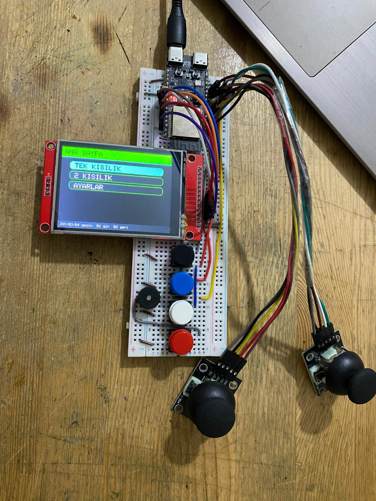
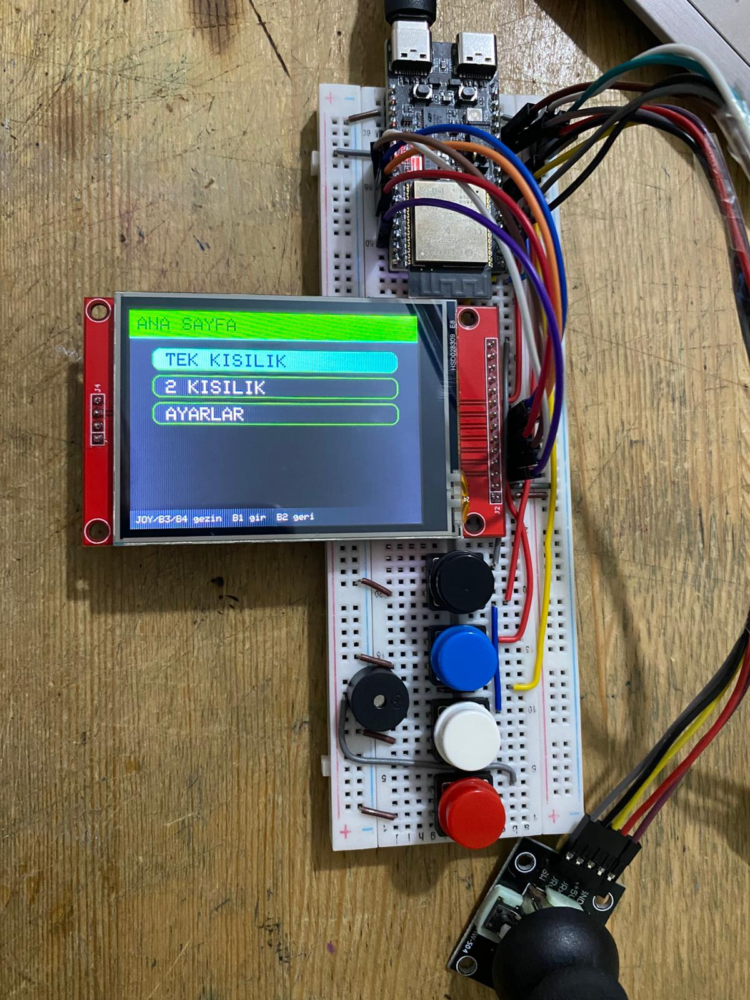

# NeoArcade32

### ESP32-C6 Powered Mini Arcade Console

> A fully-featured handheld arcade system built with ESP32-C6, featuring multiple games, vibrant TFT graphics, sound, and modular input controls.

---

## Overview

**NeoArcade32** is a compact yet powerful arcade console designed for embedded systems enthusiasts.
Built on the ESP32-C6 platform, it combines real-time graphics rendering, multi-game architecture, responsive controls, and customizable UI into a single firmware.

This project demonstrates:

* Embedded game development
* Real-time input handling
* SPI TFT graphics optimization
* Modular system design

---

## Key Features

### Multi-Game System

Includes multiple playable games:

* 🟥 Dodge (Reflex-based survival)
* 🟩 Snake (Classic grid gameplay)
* 🟦 Breakout (Brick destruction physics)
* 🐦 Flappy Bird (Physics-based tap game)
* 🏃 Runner (Endless obstacle jumping)
* 🚗 **Car Racer (NEW)** (Lane-based racing game)
* 🏓 Pong Duel (2 Player)
* ⚡ Reflex Duel (Reaction speed battle)
* 🧩 Arena Duel (Coin collection PvP)

---

### Smart Input System

* Dual joystick support
* 4-button control system (fully mapped)
* Deadzone calibration
* Debounced input handling

---

### Advanced UI System

* Smooth menu navigation
* Neon color themes
* Dynamic headers & cards
* Status HUD (score, state)
* Animated boot/loading screen

---

### Hardware Effects

* RGB LED feedback (game states)
* Buzzer sound system (tone-based)
* Backlight control

---

### Settings Menu

* Sound ON/OFF
* Theme switching
* Difficulty levels
* Deadzone adjustment
* Joystick calibration
* RGB LED test

---

## System Architecture

```
Core Loop
 ├── Input System
 ├── Page Manager (State Machine)
 │    ├── Menu Pages
 │    ├── Game Pages
 │    └── Settings
 ├── Rendering Layer (TFT)
 └── Sound + RGB Feedback
```

The entire system is built around a **state-driven architecture**, ensuring:

* clean transitions
* modular game logic
* easy expansion

---

## Software Design Highlights

### State Machine

Each screen is a state:

```
HOME → GAME → GAMEOVER → MENU
```

### Modular Game Engine

Each game:

* `initGame()`
* `updateGame()`
* `drawGame()`

### Frame Control

* Millisecond-based timing (`millis()`)
* No blocking loops
* Smooth gameplay

---

## Hardware Requirements

| Component         | Description         |
| ----------------- | ------------------- |
| ESP32-C6          | Main MCU            |
| ILI9341 TFT       | 240x320 SPI Display |
| Joystick (1-2)    | Analog control      |
| Push Buttons (x4) | Input               |
| RGB LED           | Feedback            |
| Buzzer            | Sound               |

---

## Pin Configuration

```cpp
TFT:
CS   -> GPIO17
RST  -> GPIO18
DC   -> GPIO19
BL   -> GPIO20
SCK  -> GPIO21
MOSI -> GPIO22

Joystick 1:
VRX -> GPIO0
VRY -> GPIO1
SW  -> GPIO2

Joystick 2:
VRX -> GPIO3
VRY -> GPIO4
SW  -> GPIO5

Buttons:
BTN1 -> GPIO6
BTN2 -> GPIO7
BTN3 -> GPIO9
BTN4 -> GPIO10

Buzzer:
GPIO11

RGB LED:
R -> GPIO14
G -> GPIO15
B -> GPIO16
```

---

## Controls

| Input    | Function               |
| -------- | ---------------------- |
| BTN1     | Select / Jump / Action |
| BTN2     | Back / Exit            |
| BTN3     | Left / Up              |
| BTN4     | Right / Down           |
| Joystick | Movement               |

---

## Featured Game: Car Racer

A lane-based arcade racing game:

* 3-lane movement system
* Increasing difficulty
* Collision detection
* Turbo boost (BTN1)
* Dynamic enemy spawn

---

## Display System

* Resolution: **320x240**
* Interface: SPI
* Driver: ILI9341

### Rendering Techniques:

* Partial redraws for performance
* Layered drawing (HUD + game)
* Color-coded UI states

---

## Audio System

* PWM-based tone generation
* Game feedback sounds
* Event-driven audio triggers

---

## RGB Feedback System

RGB LED indicates system state:

| State  | Color    |
| ------ | -------- |
| Menu   | Green    |
| Game   | Blue     |
| Danger | Red      |
| Boot   | Gradient |

---

## Installation

### 1. Install Arduino IDE

Download from: https://www.arduino.cc/

### 2. Install ESP32 Board

* Open Board Manager
* Install: **ESP32 by Espressif**

### 3. Install Libraries

* Adafruit GFX
* Adafruit ILI9341

### 4. Upload Code

* Select ESP32-C6 board
* Upload `.ino`

---

## Known Issues

* Joystick calibration varies per hardware
* Some ESP32 core versions require LEDC adjustments
* TFT speed depends on SPI config

---

## Performance Notes

* Optimized for **real-time rendering**
* Minimal memory footprint
* Stable FPS across games

---

## Future Roadmap

* > Advanced sound engine
* > High score saving
* > WiFi multiplayer
* > Tetris / Space Invaders
* > Game plugin system

---

## 📸 Showcase





---

## Author

**Hamza Deniz YILMAZ - Creart Soft**

---

## Contributing

Contributions are welcome!

1. Fork the repo
2. Create a branch
3. Submit a pull request

---

## Support

If you like this project:

* Star the repository
* Fork it
* Share ideas

---

## License

MIT License (recommended)

---

## Final Note

NeoArcade32 is not just a game project —
it's a complete **embedded system showcase** combining hardware + software + UX.

---
